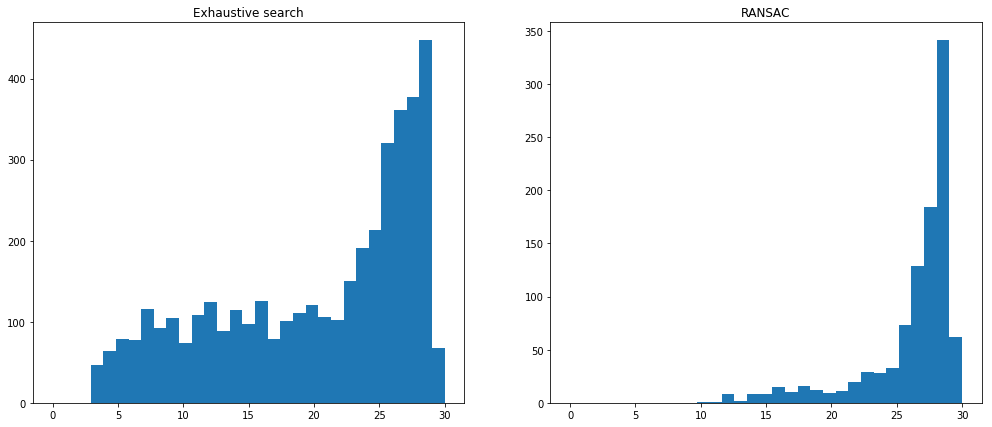

# EXERCISE 1 - ROBUST ESTIMATION AND OPTIMIZATION

## 1. EXERCISE PART 1: RANSAC for circle fitting

### 1.1. Data generation.

### 1.2. RANSAC.

### 1.3. Exhaustive search.

### 1.4. Answer of the questions.

* <b style="color:red"> Question 1: </b> How many combinations (exhaustive search) exist for $N=100$ points? 
	There are ${100!\over3!97!} = 161700$ combinations.

* <b style="color:red"> Question 2: </b> What about the number of RANSAC iterations with $r=5\%$, $20\%$, $30\%$ and $70\%$? 

  The number of iteration is calculated using the following formula:
  $$
  N = ceil({log(1-guaranteed\ accuracy) \over log(1-(1-r)^s)})
  $$
  , where guaranteed accuracy is $99\%$, sample size $s$ is $3$.

  | r      | 5%   | 20%  | 30%  | 70%  |
  | ------ | ---- | ---- | ---- | ---- |
  | n_iter | 3    | 7    | 11   | 169  |

* <b style="color:red"> Question 3: </b> What about when $N=100,000$ points?

  There are ${100000!\over3!99997!} = 166661666700000$

* <b style="color:red"> Question 4: </b> Does exhaustive search on all the combinations of data points guarantee the optimal solution (in terms of number of inliers)? Why?

  Yes. Because exhaustive search tries all the possibilities, and finds the global optimized solution.

* <b style="color:red"> Question 5: </b> Does RANSAC always find close to the optimal number of inliers? Why? If not, would increasing the number of RANSAC iterations improve that?

  No. Because RANSAC only finds optimized solution in randomly generated samples, it is possible that the optimal solution is not tried by the algorithm. 

  Increasing the number of iterations does improve the performance. According to the following equation:
  $$
  p = (1-(1-r)^s)^N
  $$
  , where $N$ represents the number of iterations, $p$ represents the probability that all selected samples are inliers. Increase $N$ will increase $p$. 

* <b style="color:red">Discuss and compare the results obtained by RANSAC and exhaustive search in terms of
  number of inliers, speed, number of synthesized inliers, etc.</b>

  * Number of inliers: The number of inliers of exhaustive search is always larger or equal to RANSAC. Because exhaustive search guarantees the optimal solution. 

  * Speed: RANSAC is faster in general cases. The running time of RANSAC only depends on the guaranteed accuracy and the outlier rate, but exhaustive search depends on the sample size. When sample size is large, RANSAC is faster. 

  * Number of synthesized inliers: As shown in the following figure, the number of synthesized inliers distribute more uniformly for exhaustive search (especially when the number is small), since it tries all possible combinations. For example, if three points that are closed to each other are selected, it will generate a small circle. For RANSAC, this situation is rare since we randomly select the minimum sufficient number of samples to fit a circle. 

    

    