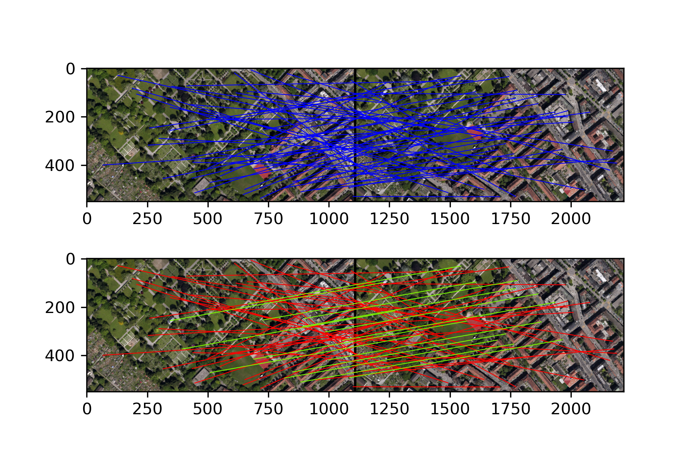
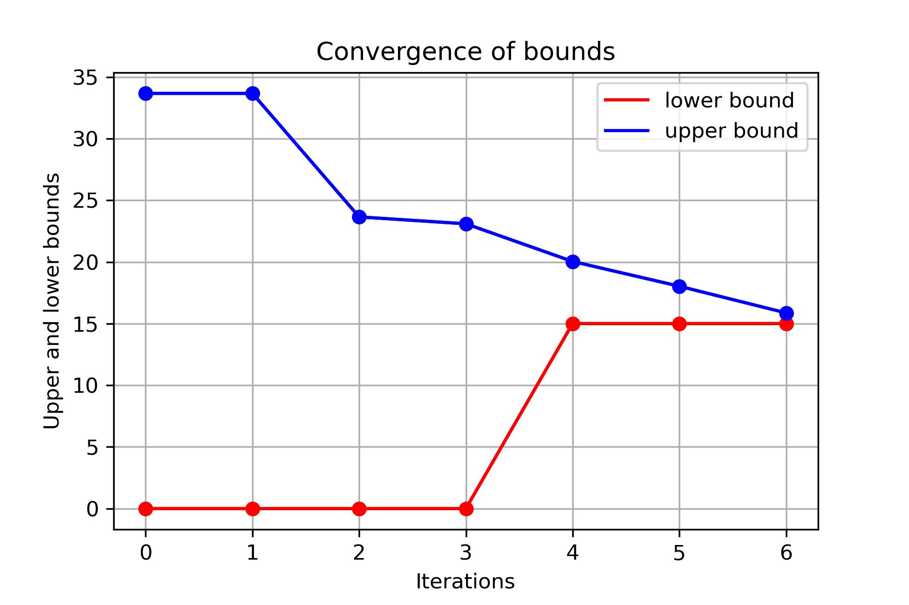

# EXERCISE 2 - GLOBAL OPTIMIZATION

## A. Linear Programming Reformulation

Derivation of the problem formulation in the canonical form of Linear Programming

* Let the set $S$ of the input data be partitioned into an inlier-set $S_I ⊆ S$ and an outlier-set $S_O = S \backslash SI$ . The model $Θ = T = (T_x,T_y) ∈ \mathbb R^2$ where $T_x$ and $T_y$ represent the translation along the $x$ and $y$ axis. The $i$-th input correspondence $(p_i,p^′_i)$ where $p_i$ and $p^′_i$ represent the points in the left and right images. Their $x$ and $y$ coordinates are written $p_i = (x_i, y_i)$ and $p^′_i = (x^′_i, y^′_i)$. We have $n$ input correspondences, i.e. $i = 1, . . . , n$. The maximization problem is define as:
  $$
  \max_{\Theta, S_I}\ \ \ \ \ \ \ \ \ \ \ \ \ \ \ \ \ \ \ \ \ \ card(S_I)\\
  s.t. |x_i + T_x - x'_i| \leq \delta, \forall i \in S_I \subseteq S \\
  \ \ \ \ \ \ |y_i + T_y - y'_i| \leq \delta, \forall i \in S_I \subseteq S
  $$

* By introducing binary variable $z_i \in \{0,1\}, i=1,...,n$, we let $z_i=1$ represents the $i$-th correspondence is an inlier, and introducing the upperbound and lowerbound for translation, we have the following reformulation:
  $$
  \max_{\Theta, \bf z}\ \ \ \ \ \ \ \ \ \ \ \ \ \ \ \ \ \ \ \ \ \ \sum_{i=1}^Nz_i\\
  s.t.\ z_i |x_i + T_x - x'_i| \leq z_i\delta,\ \forall i \in S_I \subseteq S \\
  z_i|y_i + T_y - y'_i| \leq z_i\delta,\ \forall i \in S_I \subseteq S \\
  z_i \in [0,1],\ \forall i \in S_I \subseteq S \\
  {\underline {T_x}} \leq T_x \leq {\bar {T_x}},\ {\underline {T_y}} \leq T_y \leq {\bar T_y}
  $$

  * Note that we relax the binary bariables $z_i$ to a continuous interval. Because if $z_i$ is fractional, maximizing the objective would force $z_i=1$. Since the binary variables appear on both sides of the inequalities the constraints become active as soon as $z_i > 0$. 

* By removing the absolute sign, we have:
  $$
  z_i (x_i + T_x - x'_i) \geq -z_i\delta,\\
  z_i (x_i + T_x - x'_i) \leq z_i\delta,\\
  z_i (y_i + T_y - y'_i) \geq -z_i\delta,\\
  z_i (y_i + T_y - y'_i) \leq z_i\delta,\\
  $$

* By converting the bilinear term to the concave and convex term, and introducing auxiliary variables $w_{ix} = z_iT_x, w_{iy} = z_iT_y$, we have (only $x$ is shown):
  $$
  w_{ix} = z_iT_x \geq max(\underline{z_i}T_x+\underline{T_x}z_i-\underline{z_iT_x}, \bar{z_i}T_x+\bar{T_x}z_i-\bar{z_i}\bar{T_x})\\
  w_{ix} = z_iT_x \leq min(\bar{z_i}T_x+\underline{T_x}z_i-\bar{z_i}\underline{T_x}, \underline{z_i}T_x+\bar{T_x}z_i-\underline{z_i}\bar{T_x})\\
  $$

* By removing the $max$ and $min$, and replacing the parameters in $(3)$, we have the final result:
  $$
  \max_{\Theta, \bf z} \sum_{i=1}^Nz_i\\
  s.t. \forall i \in S_I \subseteq S \\
  z_i \in [0,1]\\
  \underline{z_i}T_x+\underline{T_x}z_i - w_{ix}\leq \underline{z_iT_x}\\
  \bar{z_i}T_x+\bar{T_x}z_i - w_{ix} \leq \bar{z_i}\bar{T_x}\\
  -\bar{z_i}T_x-\underline{T_x}z_i + w_{ix}\leq -\bar{z_i}\underline{T_x}\\
  -\underline{z_i}T_x - \bar{T_x}z_i + w_{ix}\leq -\underline{z_i}\bar{T_x}\\
  
  \underline{z_i}T_y+\underline{T_y}z_i - w_{iy}\leq \underline{z_iT_y}\\
  \bar{z_i}T_y+\bar{T_y}z_i - w_{iy} \leq \bar{z_i}\bar{T_y}\\
  -\bar{z_i}T_y-\underline{T_y}z_i + w_{iy}\leq -\bar{z_i}\underline{T_y}\\
  -\underline{z_i}T_y - \bar{T_y}z_i + w_{iy}\leq -\underline{z_i}\bar{T_y}\\
  
  z_i(x_i  - x'_i - \delta) + w_{ix} \leq 0,\\
  z_i(-x_i  + x'_i - \delta)- w_{ix} \leq 0,\\
  z_i(y_i  - y'_i - \delta) + w_{iy} \leq 0,\\
  z_i(-y_i  + y'_i - \delta)- w_{iy} \leq 0,\\
  {\underline {T_x}} \leq T_x \leq {\bar {T_x}},\ {\underline {T_y}} \leq T_y \leq {\bar T_y}
  $$

* To build the canonical form, we have:
  $$
  \min_{x}c^T{\bf x} \\
  s.t. {\bf Ax} \leq b\\
  and\ l_b \leq {\bf x} \leq u_b
  $$

  * ${\bf x} = [z_1, ..., z_n,w_{1x},...,w_{nx},w_{1y},...,w_{ny}, T_x, T_y]^T$ 
  
  * $l_b=[\underline{z_1},...,\underline{z_n}, -\infty,...,-\infty, \underline{T_x}, \underline{T_y}]$ ($\underline{z_i}=0$)
  
  * $u_b=[\bar{z_1},...,\bar{z_n}, \infty,...,\infty, \bar{T_x}, \bar{T_y}]$ ($\bar{z_i}=1$)
  
  * $c=[-1,...,-1,0,...,0,0,0]$
    $$
    A_i = \begin{bmatrix}
    0&... & \underline{T_x} & ... & 0, & 0&... & -1 & ... & 0, & 0 & ... & 0 & ... & 0, & \underline{z_i} & 0\\
    0&... & \bar{T_x} & ... & 0, & 0&... & -1 & ... & 0, & 0 & ... & 0 & ... & 0, & \bar{z_i} & 0\\
    0&... & -\underline{T_x} & ... & 0, & 0&... & 1 & ... & 0, & 0 & ... & 0 & ... & 0, & -\bar{z_i} & 0\\
    0&... & -\bar{T_x} & ... & 0, & 0&... & 1 & ... & 0, & 0 & ... & 0 & ... & 0, & -\underline{z_i} & 0\\
    
    0&... & \underline{T_y} & ... & 0, & 0&... & 0 & ... & 0, & 0 & ... & -1 & ... & 0, & 0 & \underline{z_i}\\
    0&... & \bar{T_y} & ... & 0, & 0&... & 0 & ... & 0, & 0 & ... & -1 & ... & 0, & 0 & \bar{z_i}\\
    0&... & -\underline{T_y} & ... & 0, & 0&... & 0 & ... & 0, & 0 & ... & 1 & ... & 0, & 0 & -\bar{z_i}\\
    0&... & -\bar{T_y} & ... & 0, & 0&... & 0 & ... & 0, & 0 & ... & 1 & ... & 0, & 0 & -\underline{z_i}\\
    
    0&... & (x_i-x'_i-\delta) & ... & 0,  & 0&... & 1 & ... & 0, & 0 & ... & 0 & ... & 0, & 0 & 0\\
    0&... & (-x_i+x'_i-\delta) & ... & 0,  & 0&... & -1 & ... & 0, & 0 & ... & 0 & ... & 0, & 0 & 0\\
    0&... & (y_i-y'_i-\delta) & ... & 0,  & 0&... & 0 & ... & 0, & 0 & ... & 1 & ... & 0, & 0 & 0\\
    0&... & (-y_i+y'_i-\delta) & ... & 0,  & 0&... & 0 & ... & 0, & 0 & ... & -1 & ... & 0, & 0 & 0\\
    
    \end{bmatrix}\\b_i = [\underline{z_i}\underline{T_x}, \bar{z_i}\bar{T_x}, -\bar{z_i}\underline{T_x}, -\underline{z_i}\bar{T_x}, \underline{z_i}\underline{T_y}, \bar{z_i}\bar{T_y}, -\bar{z_i}\underline{T_y}, -\underline{z_i}\bar{T_y}, 0, 0, 0, 0]^T\\
    A = \begin{bmatrix}
    A_1\\
    A_2\\
    \vdot\\
    \vdot\\
    \vdot\\
    A_n
    \end{bmatrix}, b = \begin{bmatrix}
    b_1\\
    b_2\\
    \vdot\\
    \vdot\\
    \vdot\\
    b_n
    \end{bmatrix}
    $$

## B. Code for Branch and Bound

The code implementing branch and bound for consensus set maximization with a 2D translation model: See the jupyter notebook file in the code folder

## C. Results

The results of the translation model, and the indices of the inliers and outliers obtained by branch and bound

```
ThetaLowerBound: (-274, -276)
ThetaUpperBound: (0, 0)
ObjLowerBound: 15
ObjUpperBound: 15.866963107682938
ThetaOptimizer: (-232.0, -154.0)

Inlier indices: 
[2, 7, 8, 14, 15, 19, 25, 30, 31, 33, 34, 39, 41, 44, 50]
Outlier indices: 
[0, 1, 3, 4, 5, 6, 9, 10, 11, 12, 13, 16, 17, 18, 20, 21, 22, 23, 24, 26, 27, 28, 29, 32, 35, 36, 37, 38, 40, 42, 43, 45, 46, 47, 48, 49, 51, 52, 53, 54]
```

## D. Correspondences Figure

A figure showing the identified inlier and outlier correspondences



## E. Cardinality Bounds Figure

A figure showing the convergence of the cardinality bounds i.e. the highest lower bound obtained so far, and the highest upper bound still in the list.


