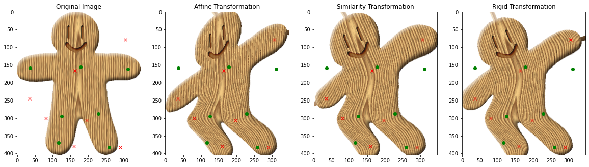
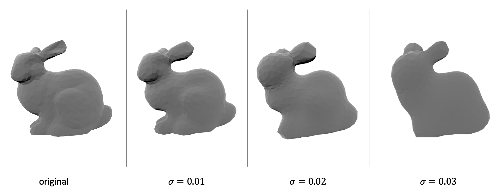
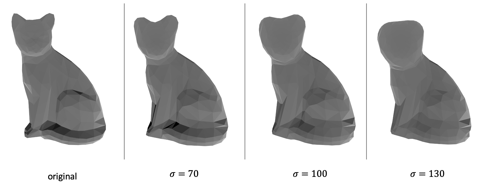

# EXERCISE 3 - MLS FOR CURVES, MESHES AND IMAGES

Please add the image in the zip folder to the `data` folder and run the `ipynb` file.

## Task 1: Image deformation using MLS

* The code is in the `ipynb` file

* The result of transformation is shown below:

  

  .png)

## Task 2.1/2.2: Curve and Surface Reconstruction Using MLS

* Implicit function derivation

  * The objective function can be expressed in the following form:

  $$
  \underset{c_0}{\operatorname{argmin}}f(c_0)=\underset{c_0}{\operatorname{argmin}}\sum_i \phi_i(\mathbf{x})(c_0 - \mathbf{n_i}^T(\mathbf{x} - \mathbf{x_i}))^2\\
  $$
  * If we take the derivative of the objective function $f$ w.r.t $c_0$:

  $$
  {\delta f \over \delta c_0} = \sum_i 2\phi_i({\bf x})(c_0 - \mathbf{n_i}^T(\mathbf{x} - \mathbf{x_i})) = 0\\
  2c_0\sum_i \phi_i({\bf x}) = 2\sum_i \phi_i({\bf x})\mathbf{n_i}^T(\mathbf{x} - \mathbf{x_i}) \\
  f({\bf x}) = c_0 = {\sum_i \phi_i({\bf x})\mathbf{n_i}^T(\mathbf{x} - \mathbf{x_i}) \over \sum_i \phi_i({\bf x})} = {\sum_i {\phi_i({\bf x})\over \sum_i \phi_i({\bf x})}\mathbf{n_i}^T(\mathbf{x} - \mathbf{x_i}) } \\
  $$

* The visualization of the grid values estimated by MLS with different sigma is shown below:

  .png)

  .png)

  .png)

  .png)

  .png)

  .png)

* Bonus: The bonus is achieved by replacing the orignal $\phi$ function by a numerical stable softmax function. The softmax function is implemented as following:

  ```python
  phi = np.exp(x - np.max(x))
  softmax = phi / np.sum(phi)
  ```

## Task 3: Curve and Surface Reconstruction Using MLS

* Derivation of gradient of function $f$
  $$
  f({\bf x}) = c_0 = {\sum_i \phi_i({\bf x})\mathbf{n_i}^T(\mathbf{x} - \mathbf{x_i}) \over \sum_i \phi_i({\bf x})} = {\sum_i {\phi_i({\bf x})\over \sum_i \phi_i({\bf x})}\mathbf{n_i}^T(\mathbf{x} - \mathbf{x_i}) } \\
  \nabla f({\bf x}) = \nabla  {{\sum_i \phi_i({\bf x})\mathbf{n_i}^T(\mathbf{x} - \mathbf{x_i}) \over \sum_i \phi_i({\bf x})}}\\
  = { \nabla(\sum_i \phi_i({\bf x})\mathbf{n_i}^T(\mathbf{x} - \mathbf{x_i})) (\sum_i \phi_i({\bf x})) - (\sum_i \phi_i({\bf x})\mathbf{n_i}^T(\mathbf{x} - \mathbf{x_i})) \nabla (\sum_i \phi_i({\bf x}))\over (\sum_i \phi_i({\bf x}))^2}\\
  = { (\sum_i \nabla \phi_i({\bf x})\mathbf{n_i}^T(\mathbf{x} - \mathbf{x_i}) + \sum_i\phi_i({\bf x}){\bf n_i}) (\sum_i \phi_i({\bf x})) - (\sum_i \phi_i({\bf x})\mathbf{n_i}^T(\mathbf{x} - \mathbf{x_i})) \nabla (\sum_i \phi_i({\bf x}))\over (\sum_i \phi_i({\bf x}))^2}\\
  = { (\sum_i \nabla \phi_i({\bf x})\mathbf{n_i}^T(\mathbf{x} - \mathbf{x_i}) + \sum_i\phi_i({\bf x}){\bf n_i}) - f({\bf x})\nabla (\sum_i \phi_i({\bf x}))\over \sum_i \phi_i({\bf x})}\\
  = { \sum_i (\nabla \phi_i({\bf x})(\mathbf{n_i}^T(\mathbf{x} - \mathbf{x_i}) - f({\bf x})) + \phi_i({\bf x}){\bf n_i})\over \sum_i \phi_i({\bf x})}
  $$

* The result is shown below

  * `bunny.off`

    

  * `cat.off`

    

