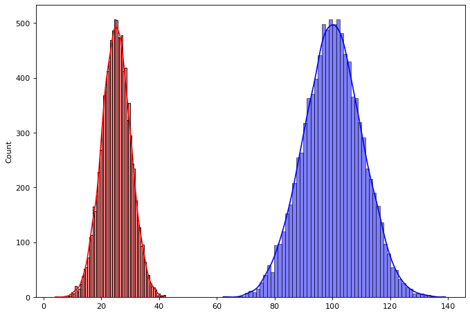
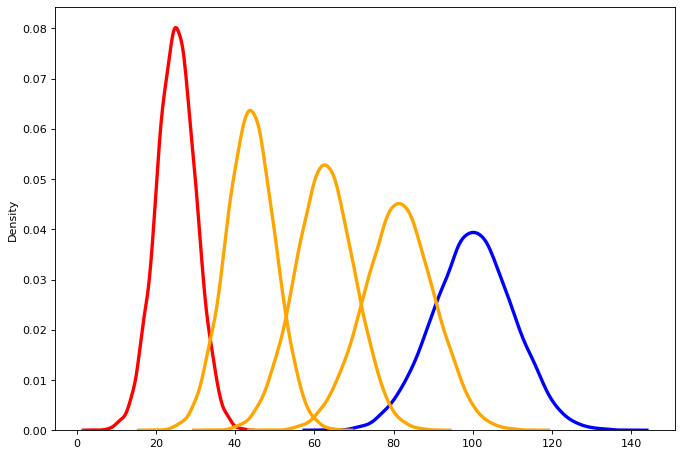
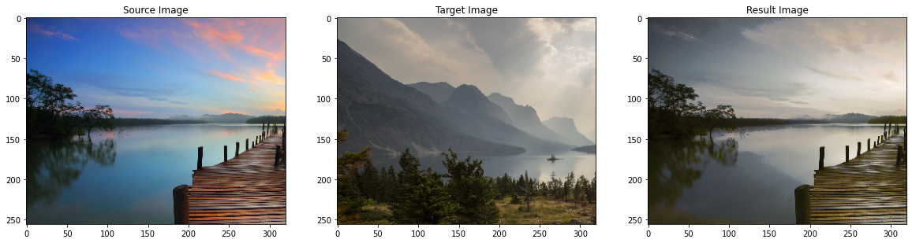
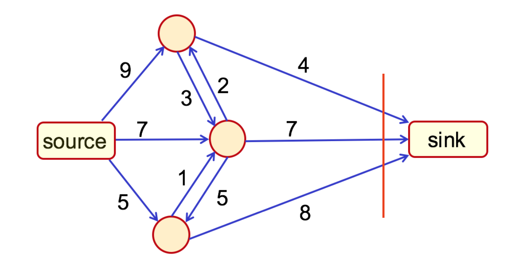
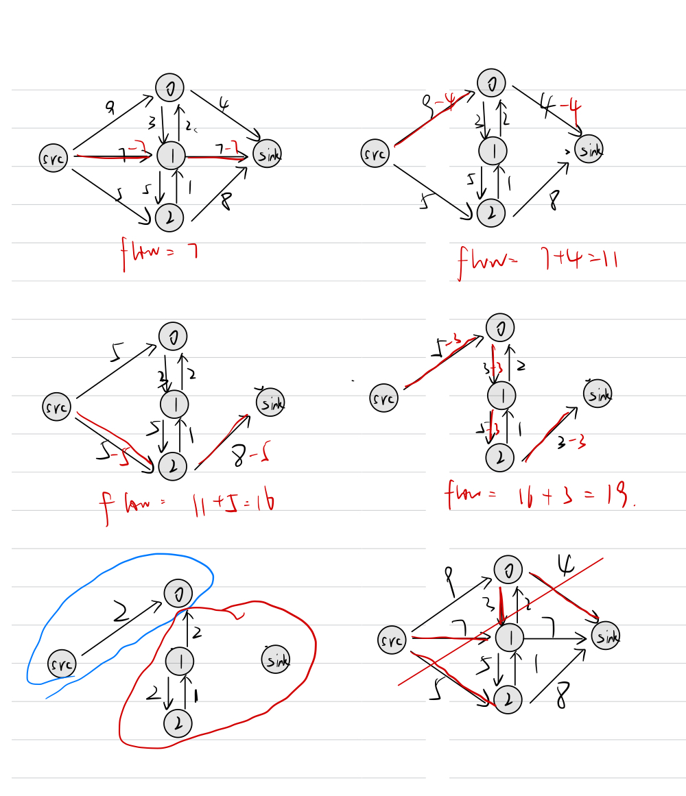
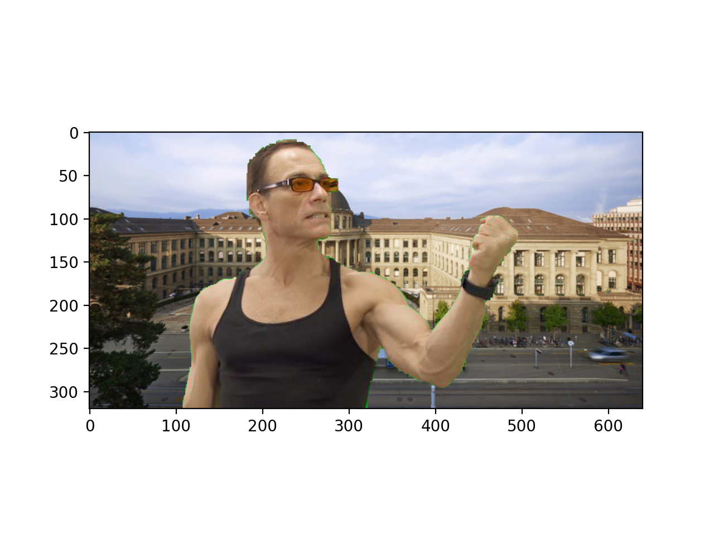
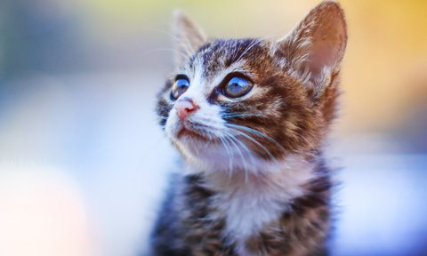

# Exercise 4 - OPTIMAL TRANSPORT AND GRAPH CUTS

### Code Implemented

* Part 1: This part includes optimal transport in 1D and color transfer using sliced optimal transport. The implementation is in the file `/code/OptimalTransport/MATHFOUND22-Deheng-Zhang.ipynb`. (the package `tqdm` is needed to run the code)
* Part 2: This part includes the code for handling Max Flow and interactive segmentation. The implementations are in the file `/code/GraphCuts/main_task1.py` and `/code/GraphCuts/graph_cut_controller.py` . Just run `python main_task1.py` and `python main_task2.py` to check the result. 

## PART 1: Optimal Transport

### 1.1. Task 1 - Optimal Transport in 1D

* The plot of 10000 points is shown in the following figure:



* The visualizatiobn of PDF of the interpolation is shown in the following figure:

  

### 1.2. Task 2 - Color Transfer Using Sliced Optimal Transport

* The result of color transfer is shown in the following figure, the result is similar to the Figure 2 of the instruction: 

  

  

## PART 2: Interactive Segmentation with Graph Cut
### 2.1. Task 1 - Handling Max Flow

* The result of using the library to solve the max flow problem is shown below:

  ```shell
  Optimized energy: 19.000000
  label of node 0: 0
  label of node 1: 0
  label of node 2: 0
  ```

  * All the nodes are labeled to the source, as shown in the following figure:

    

* The result of manually solve max flow problem is shown below:

  * The total cost is 19, node 0 is labeled as source, and node 1, 2 are labeled as sink. 
  * Both of manually and library results are correct since the flow values are the same. 




### 2.2. Task 1 - Handling Max Flow

* The segmentation result is shown below:

  |           | $\lambda=0$                                                  | $\lambda=0.0001$                                             | $\lambda=0.002$                                              | $\lambda=1$                                                  |
  | --------- | ------------------------------------------------------------ | ------------------------------------------------------------ | ------------------------------------------------------------ | ------------------------------------------------------------ |
  | Van Damme |  |  |  |  |
  | Batman    |  |  |  |  |

* The Van Damme picture with a new background ($\lambda = 1$)

  

* Segmentation of an image chosen by you.

  | Input                  | Scribbles                                                    | Result ($\lambda=0.01$)                                      |
  | ---------------------- | ------------------------------------------------------------ | ------------------------------------------------------------ |
  |  |  |  |

  

* Discuss the benefits of graph cut for image segmentation

  * The graph cut algorithm is based on probabilistic mode (MRF), therefore it has specific mathmatical meaning for segmentation. The segmentation task is achieved by energy minimization. 
  * It is efficient compared to the CNN based methods (no need to training) and Hough transform (no need to design the function specific shape), and more robust compared to other probability based algorithm (K-means, EM). 
  * It can be combined with other methods, since the segmentation result of other methods can be used as a prior for constructing the unary terms. Thus it can be used to postprocess the segmentation result. 