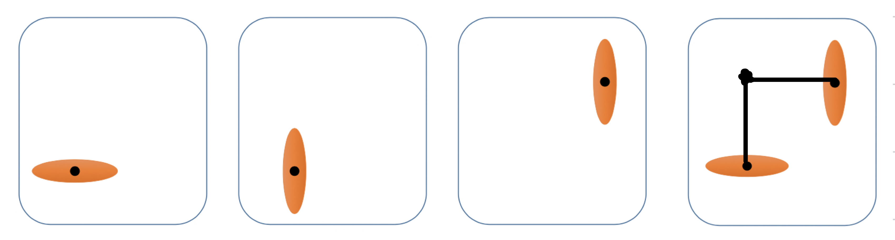
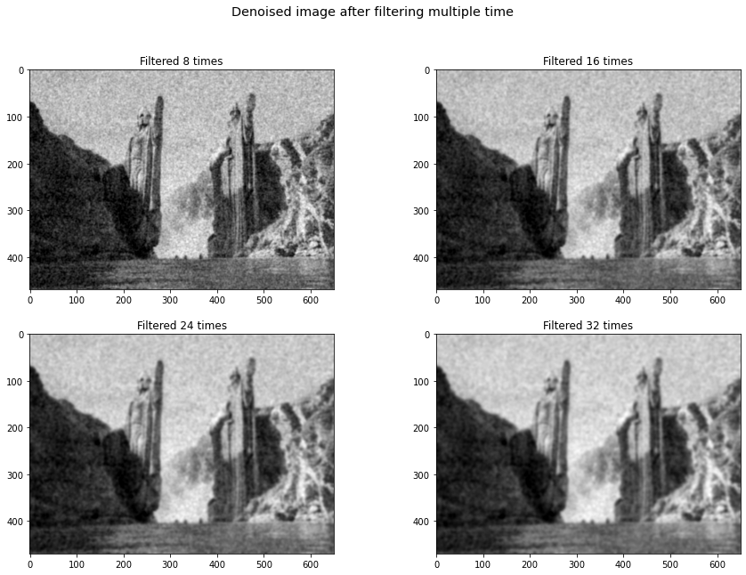
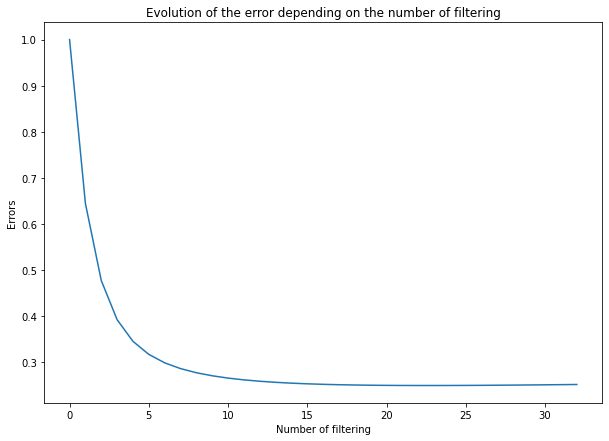
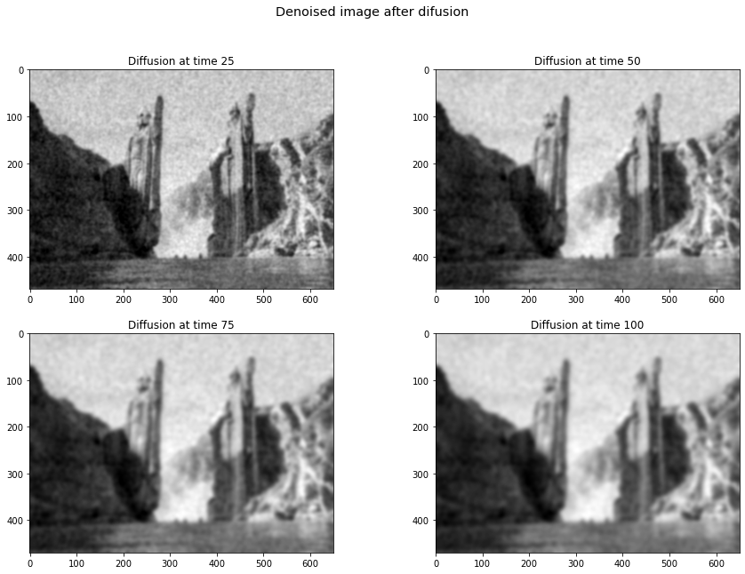
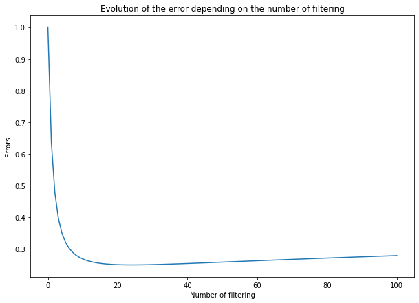
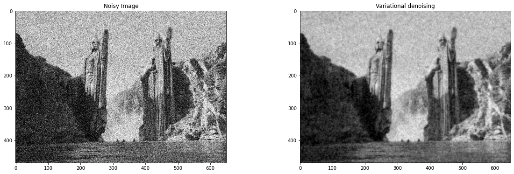
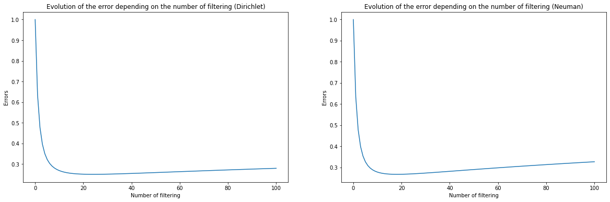
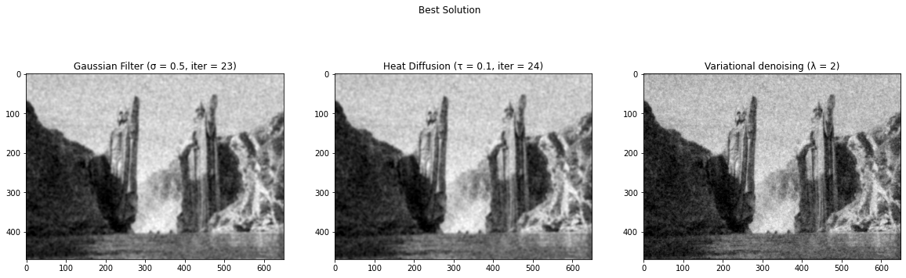

# Exercise 5 - RIGID TRANSFORM BLENDING AND VARIATIONAL METHODS

### Code Implemented

* The code for PART 2: Variational Methods - Denoising problems is in the file `/code/part2.ipynb`. Just run the Jupiter notebook to check the result.

## PART 1: Understanding and Utilizing Dual Quaternions

### 1.1. Task 1 - Thinking about fundamental properties

* Question 1: What is the advantage of representing rigid transformations with dual quaternions for blending?
  * **Compared with matrix multiplication**, dual quaternions use 8 numbers instead of 12 numbers (9 for rotation, 3 for translation), thus it is more memory efficient. Besides, the linear interpolation for matrix cannot guarantee the result rotation matrix is orthonormal, the result may not be a rigid transformation. In this case, the matrix multiplication method will create skin-collapsing effect. 
  * **Compared with quaternions**, dual quaternions can represent 3D translation as well as the rotation, but quaternions can only represent 3D rotation.
* Question 2: Briefly explain one fundamental disadvantage of using quaternion based shortest path blending for rotations as compared to linear blend skinning (i.e. averaging rotation matrices)? Hint: think about the continuity of both blending methods for 2D rotations.
  * There is a “flipping artifact” which occurs with joint rotations of more than 180 degrees. Since the shortest path interpolation is used, when the rotation angle is nearby 180 degree, the shortest path is changed (e.g. from clockwise to counterclockwise). Therefore, the rotation effect will change suddenly when the angle reaches 180 degrees. 

### 1.2. Task 2 - Derivations and deeper understanding

* Question 3: Utilizing the properties above, for a dual quaternion $\hat q = cos(\hat θ/2) + \hat s sin(\hat θ/2)$, prove that $\hat q^t = \cos(t\hat θ/2) + \hat s \sin(t\hat θ/2)$. Hint: you do not need to know the expression for $cos(\hat θ)$ or $sin(\hat θ)$.
  $$
  \hat {\bf q}^t = e^{t\log \hat {\bf q}} = e^{t\log (\cos(\hat θ/2) + \hat s \sin(\hat θ/2))} = e^{{t \over 2}\hat {\bf s}\hat θ} \\
  $$
  Define $\hat \theta =\theta_0 + \epsilon  \theta_{\epsilon}$, $\hat{\bf s} = {\bf s_0} + \epsilon {\bf s_{\epsilon}}$, then we have:
  $$
  {t \over 2}\hat{\bf s} \hat \theta = {t \over 2}(\theta_0 + \epsilon  \theta_{\epsilon})({\bf s_0} + \epsilon {\bf s_{\epsilon}}) \\= {t \over 2}(\theta_0{\bf s_0} + \epsilon\theta_{\epsilon}{\bf s_0} + \epsilon\theta_0{\bf s_{\epsilon}} + \epsilon^2\theta_{\epsilon}{\bf s_{\epsilon}}) \\
  ={t \over 2}(\theta_0{\bf s_0} + \epsilon\theta_{\epsilon}{\bf s_0} + \epsilon\theta_0{\bf s_{\epsilon}}) \\
   = {t \over 2}\theta_0{\bf s_0} + \epsilon{t \over 2}(\theta_{\epsilon}{\bf s_0} + \theta_0{\bf s_{\epsilon}})\\
   ||{t \over 2}\hat{\bf s} \hat \theta|| = ||{t \over 2}\theta_0{\bf s_0}|| + \epsilon{{<{t \over 2}\theta_0{\bf s_0}, {t \over 2}(\theta_{\epsilon}{\bf s_0} + \theta_0{\bf s_{\epsilon}})>} \over ||{t \over 2}\theta_0{\bf s_0}||} (<s_0,s_0> = 1, <s_0,s_1> = 0)\\
    = {t \over 2}\theta_0 + \epsilon{ ({t \over 2})^2\theta_0\theta_{\epsilon}\over {t \over 2}\theta_0} \\
    = {t \over 2}\theta_0 + {t \over 2}\epsilon \theta_{\epsilon} = {t \over 2}\hat \theta
  $$
  
  Therefore, we have:
  $$
  \hat {\bf q}^t = e^{{t \over 2}\hat {\bf s}\hat θ} = \cos(||{t \over 2}\hat {\bf s}\hat θ||) + {{t \over 2}\hat {\bf s}\hat θ \over ||{t \over 2}\hat {\bf s}\hat θ||} \sin(||{t \over 2}\hat {\bf s}\hat θ||) \\
  = \cos({t\over 2}\hat \theta) + \hat{\bf s}\sin({t\over 2}\hat \theta)
  $$
  
* Question 4: Now, consider rigid transformations in the 2D $xy$-plane. For these transformations, the rotation is always around the $z$ (or $−z$)-axis, i.e. $s_0$ is fixed to the $z$-axis. On the other hand, a dual quaternion encodes translations only along $s_0$, which are in this case always zero, since we can only translate in the $xy$-plane. Then, how can a dual quaternion represent a rotation and translation in the $xy$-plane, such as the one depicted in Figure $1$? Please answer in maximum two sentences without any equations.

  * As shown in the following image, we can represents the transformation as pure rotation along a direction parallel to $z$-axis (shiftted screw). In this case the translation along $xy$-axis is zero, but it can still represents the transformation.
  
  

## PART 2: Variational Methods - Denoising problems

### 2.1. Task 1 - Filtering

The result of filtering in step 8, 16, 24, 32, and the error plot is shown below:

|  |  |
| -------------------------------------------------- | --------------------------------------------------- |

### 2.2. Task 2 - Heat diffusion

The result of filtering in step 25, 50, 75, 100, and the error plot is shown below:

|  |  |
| --------------------------------------------------- | --------------------------------------------------- |

### 2.3. Task 3: Variational approach

* Derive the energy to obtain the Euler-Lagrange equation:
  $$
  E(I) = \int_{\Omega}[(I({\bf x}) - I_0({\bf x}))^2 + \lambda||\nabla_{\bf x}I({\bf x})||^2]d{\bf x} \\
  L(I({\bf x}),\nabla_{\bf x}I({\bf x})) = (I({\bf x}) - I_0({\bf x}))^2 + \lambda||\nabla_{\bf x}I({\bf x})||^2 \\
  $$

  * The Gâteaux Derivative is defined as:
    $$
    \delta E(I, h) = \lim_{\alpha \rightarrow 0}{1 \over \alpha}[E(I + \alpha h) - E(I)] \\
    = \lim_{\alpha \rightarrow 0}{1 \over \alpha}\int_{\Omega}L(I({\bf x}) + \alpha h({\bf x}), \nabla_{\bf x} I({\bf x}) + \alpha\nabla h({\bf x})) - L(I({\bf x}), \nabla_{\bf x} I({\bf x}) )d{\bf x}
    $$

  * By using first order Taylor expansion:
    $$
    \delta E(I, h) = \lim_{\alpha \rightarrow 0}{1 \over \alpha}\int_{\Omega}L(I({\bf x}), \nabla_{\bf x} I({\bf x}) ) + \alpha h{\delta L \over \delta I}+ \alpha \nabla_{\bf x}h{\delta L \over \delta  \nabla_{\bf x} I} + O(\alpha^2) - L(I({\bf x}), \nabla_{\bf x} I({\bf x}) )d{\bf x} \\
     =\int_{\Omega}(h{\delta L \over \delta I}+ \nabla_{\bf x}h{\delta L \over \delta  \nabla_{\bf x} I}  )d{\bf x} \\
     = \int_{\Omega}h{\delta L \over \delta I}d{\bf x}+ \int_{\Omega}\nabla_{\bf x}h{\delta L \over \delta  \nabla_{\bf x} I}  d{\bf x} \\
    
     = \int_{\Omega}h{\delta L \over \delta I}d{\bf x} + h{\delta L \over \delta  \nabla_{\bf x} I} |_{\Omega} - \int_{\Omega}h  \nabla_{\bf x}{\delta L \over \delta  \nabla_{\bf x} I}  d{\bf x}
    $$

  * If we assume $h=0$ on the boundary and set the derivative to zero we have:
    $$
    \delta E(I, h) = \int_{\Omega}h({\delta L \over \delta I} -   \nabla_{\bf x}{\delta L \over \delta  \nabla_{\bf x} I}  )d{\bf x} = 0
    $$

  * $\forall h$ in the open interval (not include boundary), we have ${\delta L \over \delta I} -   \nabla_{\bf x}{\delta L \over \delta  \nabla_{\bf x} I} = 0$

  * For $L(I({\bf x}),\nabla_{\bf x}I({\bf x})) = (I({\bf x}) - I_0({\bf x}))^2 + \lambda||\nabla_{\bf x}I({\bf x})||^2$, we have:
    $$
    {\delta L \over \delta I} = 2(I - I_0) \\
    \nabla_{\bf x}{\delta L \over \delta  \nabla_{\bf x} I} =\nabla_{\bf x}2\lambda\nabla_{\bf x}I \\
    2(I - I_0) - 2\lambda\nabla_{\bf x}\nabla_{\bf x}I = 0\\
    I_0 = I - \lambda\nabla_{\bf x}\nabla_{\bf x}I = I -\lambda\ div(\nabla_{\bf x}I)
    $$

* The denoised image with $\lambda = 2$ is shown below:
  
  

### 2.4. Task 4: Comparison / Questions

* When running the gaussian convolution over and over, does the solution converge? If so, what would be the steady state? Does it depend on the boundary conditions (Neumann vs Dirichlet)?

  * Error: As shown in the plotting, the error of the solution reaches the minimum point at the 24th iteration. However, after that, the error becomes even larger since the structural information is destroyed during convolution. Therefore, the error does not converge. 

  * Image: As shown in the figure of denoised image after multiple convolutions, the step 24 looks similar to the step 32, therefore the blur effect of the image converges. 

  * The convergence does depend on the boundary conditions, as shown in the following figure. The Neuman boundary condition as a faster increment of error compared to Dirichlet. Besides, the Neuman boundary condition creates a black border in the image. 

    

* If you apply heat diffusion infinitely, does it converge to a steady state? If so, what would be the steady state? Does it depend on the boundary conditions (Neumann vs Dirichlet)?

  * Error: As shown in the plotting, the error of the solution reaches the minimum point at the 25th iteration. However, after that, the error becomes even larger since the structural information is destroyed during heat diffusion. Therefore, the error does not converge. 

  * Image: As shown in the figure of denoised image after multiple iterations, the step 75 looks similar to the step 100, therefore the blur effect of the image converges. 

  * The convergence does depend on the boundary conditions, as shown in the following figure. The Neuman boundary condition as a faster increment of error compared to Dirichlet. Besides, the Neuman boundary condition creates a black border in the image. 

    

* What is the Euler Lagrange equation of an energy? What is its purpose?

  * The energy is defined as an integration of a function $L:\Omega \times \Omega ^ n\times \Omega \mapsto \mathbb{R}, (a,b,x) \mapsto L(a, b, x)$, which is continuously differentiable.
    $$
    E(u) = \int_{\Omega}L(u, \nabla u, x) dx\ \ \ (a = u, b = \nabla u)\\
    $$

  * The Euler Lagrange equation is defined as:
    $$
    \delta_{a}L(u, \nabla u, x) - div_x(\nabla_bL(u, \nabla u, x)) = 0
    $$
    , where $\delta_aL:= {\delta L \over \delta a}$, $\nabla_bL = [{\delta L \over \delta b_1}, {\delta L \over \delta b_2}, ..., {\delta L \over \delta b_n}]^T$

  * Since the original energy function is difficult to optimize, the Euler Lagrange equation is used to find the stationary points of the given energy function. If the energy function is convex, the result is globally optimal. 

* Is the solution of the Euler-Lagrange equation globally optimal? What parameter can you modify to change the level of smoothing? Explain in your own words how it works.

  * Since the Euler-Lagrange equation is a necessary condition for global minimum, we cannot guarantee it is globally optimal generally. However, if the objective energy function is convex, the result is globally optimal. 
  * We can change smoothing parameter $\lambda$ to change the level of smoothing. 
  * As $\lambda$ Increase, the penalty for smoothness increases, therefore the result is smoother. If $\lambda = 0$, we only have the error term, which means no smoothness. If $\lambda = \infty$, we only have the smoothness term.  

* How can you describe the results? Does any of these methods give better results than the others? Explain briefly your answer.

  

  * As shown in the figure, we select the best result for the three methods. The results are similar, but the variational denoising preserve more edge informatoin compared to the other two methods. Besides, the noise points (the white points) in the variational solution are less than the other two methods.
  * In terms of the execution time, the Gaussian filter and heat diffusion methods are faster than variational method.
  * In terms of the hyperparameter tunning, we need to find the best iteration for the first two methods. But for variational method, we only need to find the best $\lambda$. 

* What are the benefits and drawbacks of each methods?

  * Gaussian filtering: 
    * Benefit: It is a simple and fast method.
    * Drawbacks: 
      * Need to find the best kernel size and number of iterations.
      * Hard to define the optimal result.
      * The detailed information is not well preserved.
      * The mathematical meaning is more about bluring instead of recovering the original information. 
      * Dependent to boundary condition. 
  * Heat diffusion
    * Benefit: Relatively simple and fast method. 
    * Drawbacks:
      * Need to find the best step size and number of iterations.
      * Hard to define the optimal result.
      * The detailed information is not well preserved.
      * Dependent to boundary condition. 
  * Variational method
    * Benefit: 
      * Detail informations are preserved.
      * The mathematical formulation is to recover the original information, explicitly minimize the error.
      * Easy to tune the hyperparameter $\lambda$  
    * Drawbacks:
      * The matrix $A$ is large, need to use the sparse linear solver to solve the linear system.
      * Difficult to derive the math formular.

* Can you explain the motivations / intuitions behind each of the methods?

  * Gaussian filtering: It works because it is a low pass filter. Intuitively, the filter gives higher weight to the center pixel, and averages the neighbor information. Therefore, the result is smoother since the peak values are averaged. 
  * Heat diffusion: The discrete laplacian (obtained by the convolution) can be viewed as an approximation of the normal vector. The intuition of heat diffusion is that we push the pixels along the direction of the normal vector. This is like blowing up a balloon, the balloon will become smoother when it is inflated.
  * Variational method: The variational method explicitly define the error functon as an integration of smoothing term and data similarity term. This method finds the explicit solution by using Euler-Lagrange equation. 