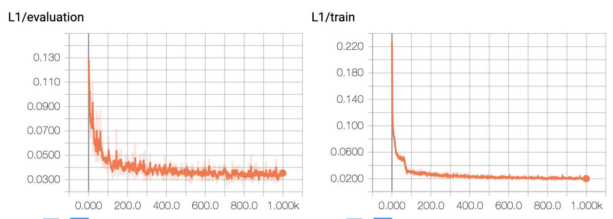
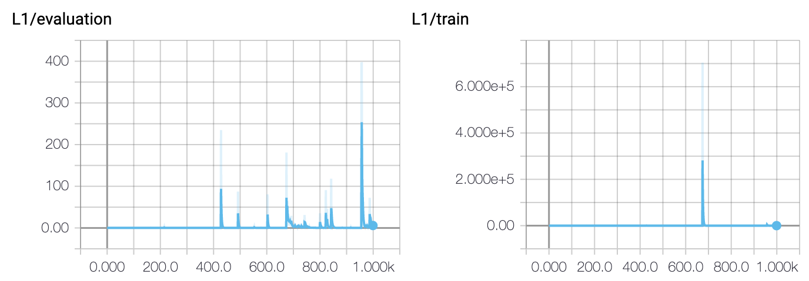
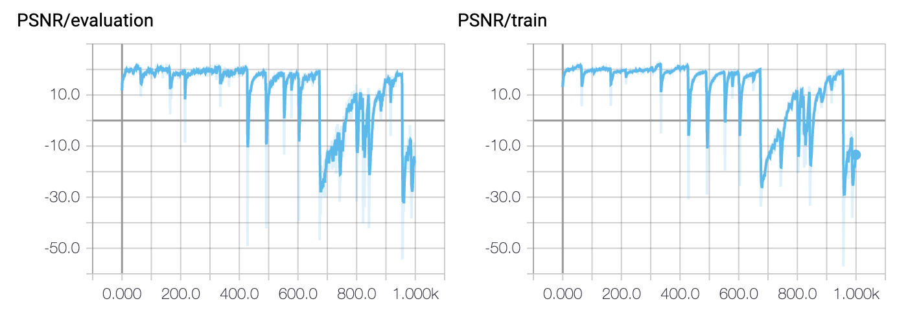
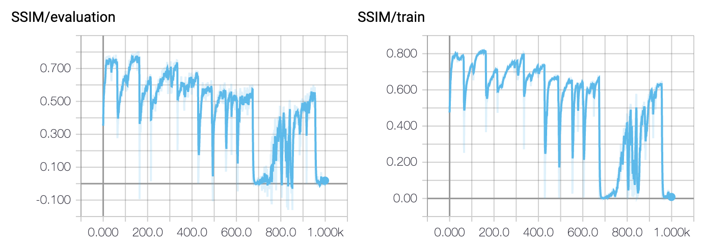
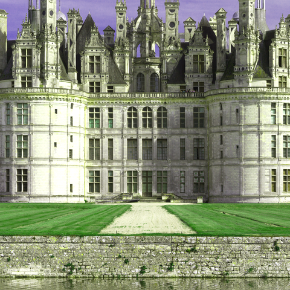
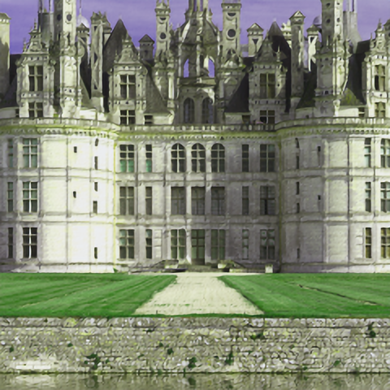
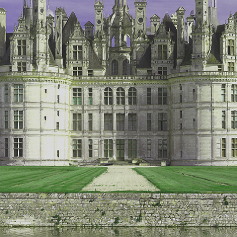

# Exercise 6 - DEEP LEARNING

## Code Implemented

* `SRDataset` class: in the `./code/dataset.py` 

* `BasicSRModel` class: in the `./code/models.py` 

* Training loop: in the `./code/train.py`

* Model evaluation: 

  * in `./code/eval.py`
  * visualization is in `./code/eval.ipynb`

* The configurations are in `./configs`

* To run the code, make sure you use the following file structure

  ```
  .
  ├── configs
  │   ├── 1e-2.yaml
  │   ├── 1e-3.yaml
  │   ├── 1e-5.yaml
  │   ├── 1e-6.yaml
  │   ├── baseline.yaml
  │   └── residual.yaml
  ├── runs
  │   ├── baseline
  │   ├── lr1e-2
  │   ├── lr1e-3
  │   ├── lr1e-5
  │   ├── lr1e-6
  │   └── residual
  ├── models
  ├── best_models
  │   ├── model_best_lr_1E-02.pth
  │   ├── model_best_lr_1E-03.pth
  │   ├── model_best_lr_1E-04.pth
  │   ├── model_best_lr_1E-05.pth
  │   ├── model_best_lr_1E-06.pth
  │   └── model_res_best_lr_1E-04.pth
  ├── train
  └── eval
  ```

* Run

  * For the training (baseline model), you should use the command in`./code`:

  ```shell
  python train.py --config ../configs/baseline.yaml
  ```

  * For the evaluation(baseline model), you should use the command in`./code`:

  ```shell
  python eval.py --config ../configs/baseline.yaml
  ```

  * Or you can directly use the `eval.ipynb` file. 

## 1.1. Task 1 - Datasets, Preprocessing and Data loading

* The result of dataset testing is

```
 * Dataset contains 301 image(s).
```

## 1.2. Task 2 - Derivations and deeper understanding

* The result of model testing is:

```
372803
```

## 1.3. Task 3 - Implement the Training Loop

* The L1 loss during training is shown below



* The parameters are saved per 200 epochs, also, the model with minimum training loss is also saved .

## 1.4. Task 4 - Model Evaluation

* Table of evaluation result:

  |                     | PSNR      | SSIM     |
  | ------------------- | --------- | -------- |
  | Bilinear (baseline) | 25.757679 | 0.867994 |
  | Bicubic (baseline)  | 24.444685 | 0.856417 |
  | Nearest (baseline)  | 21.104866 | 0.758209 |
  
* The evolution of the validation loss and training loss (L1, PSNR and SSIM) is shown below:

  |  |
  | ------------------------------------------------------------ |
  |  |
  |  |

## 1.5. Task 5 - Exploration

### A Different Model

* Training: The training loss plot is shown below (the blue one represents the residual, and the orange one represents the baseline model)
  * **Comparison**: Since the residual connections directly add the result of bilinear interpolation to the output, the performance is always better than the baseline model (lower l1 loss and higher PSNR, SSIM). 

|  |
| ------------------------------------------------------------ |
|  |
|  |

* Evaluation: Table of evaluation result:

|                     | PSNR      | SSIM     |
| ------------------- | --------- | -------- |
| Bilinear (baseline) | 25.757679 | 0.867994 |
| Bicubic (baseline)  | 24.444685 | 0.856417 |
| Nearest (baseline)  | 21.104866 | 0.758209 |
| Bilinear (Resnet)   | 27.583456 | 0.898651 |
| Bicubic (Resnet)    | 26.075844 | 0.885841 |
| Nearest (Resnet)    | 22.011930 | 0.780135 |

### Effect of the Learning Rate

* Training: The training loss plot with different learning rate is shown below (the blue one represents the residual, and the orange one represents the baseline model)

  * Without large learning rate (without 1e-2, 1e-3): orange (1e-4), pink (1e-5), green (1e-6)
  * The performance is better as learning rate getting larger in this range

  |  |
  | ------------------------------------------------------------ |
  |  |
  |  |

  * However, for the large learning rate, the performance is not stable (1e-2 red, 1e-3 blue)

  |  |  |
  | ------------------------------------------------------------ | ------------------------------------------------------------ |
  |  |  |
  |  |  |

### Different Downscaling During Inference

*  Table of evaluation result:

|                     | PSNR      | SSIM     |
| ------------------- | --------- | -------- |
| Bilinear (baseline) | 25.757679 | 0.867994 |
| Bicubic (baseline)  | 24.444685 | 0.856417 |
| Nearest (baseline)  | 21.104866 | 0.758209 |
| Bilinear (Resnet)   | 27.583456 | 0.898651 |
| Bicubic (Resnet)    | 26.075844 | 0.885841 |
| Nearest (Resnet)    | 22.011930 | 0.780135 |

* Images of superresolution result with different downscaling methods
  * As shown in the following two examples, the algorithm does have the effect to do superresolution task. However, the generated image is darker than the original one. 
  * Comparison: 
    * Since we use bilinear interpolation to train the model, the result of blinear interpolation is better than the other two (brighter and sharper result). 
    * For the nearest neighbor, the detailed texture is different from the other two methods. The result is not smooth enough because there are some strange veins in the texture.
    * For the bicubic interpolation, the result is over smoothened compared with bilinear result. 

| High resolution (ground truth) | Low resolution                                       |                         |
| ------------------------------ | ---------------------------------------------------- | ----------------------- |
|        |  |                         |
| Bilinear                       | Bicubic                                              | Nearest   neighbor      |
|         |                              |  |

| High resolution (ground truth) | Low resolution                                         |                           |
| ------------------------------ | ------------------------------------------------------ | ------------------------- |
|      |  |                           |
| Bilinear                       | Bicubic                                                | Nearest   neighbor        |
|       |                              |  |

